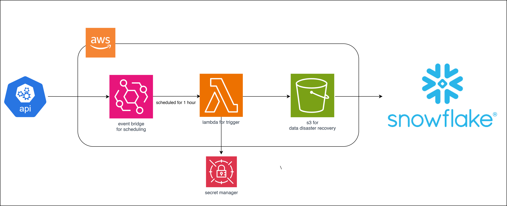

# Architecture

## Currency Exchange Rate Pipeline Overview

A serverless ETL pipeline for fetching, storing, and processing currency exchange rates from Open Exchange Rates API to Snowflake and s3 using AWS lambda, where s3 is used for disaster recovery and snowflake is used for storing the data in the layers

**make sure that your lambda runtime and ec2 runtime should be same**

- **AWS Lambda**: Executes the main ETL process on a schedule (layer attached which support python 3.9 runtime)
- **Amazon S3**: Stores raw exchange rate data as JSON files for disaster 
- **AWS Secrets Manager**: Securely manages database credentials
- **Snowflake**: Stores and processes the exchange rate data using layer
- **Layer**: create a layer by deploying an ec2 instance connect it with your local machine install the python 3.11 environment
after setting this install all the dependencies and libraries which you should need for lambda in our case there are two libraries requests and snowflake-connector after that make a zip fle install it on a local create a layer in aws upload this file and attach it to your lambda function.
- **Event Bridge**: schedule the lambda after every 1 hour 

### Policy 

`Attach these policy to your lambda role which automatically creates whenever you create a lambda function `

- S3FullAccess
- Lambda execution role
- EventBridge access
- Lambda full access
- secret manager access

### Lambda Function Setup

- Create a new Lambda function using Python 3.11
- make two files in your lambda and take the code from the code folder upload it in your lambda function 
- Set up the environment variables, all the environment variable which is used in this code is in `environment-variables.txt`.

### Secret Manger Setup

- Attach the json which is in `secret-manager.txt`. 

### S3 setup

- create a folder name raw.

### Event Bridge

- create a event bridge in aws and schedule it on every 1 hour.

### Snowflake Setup

1. Run the SQL scripts in `code/snowflake.sql` to:
   - Create the `CURRENCY_DB` database and `CURRENCY` schema
   - Create the necessary tables (`EXCHANGE_RATES_RAW`, `EXCHANGE_RATES_STG`, `EXCHANGE_RATES`)
   - Create the stored procedure for data processing

